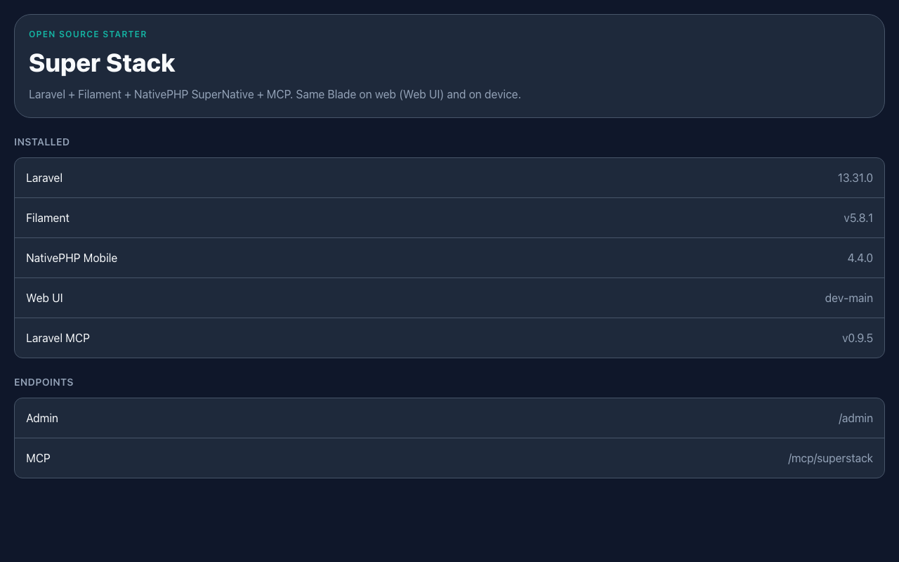
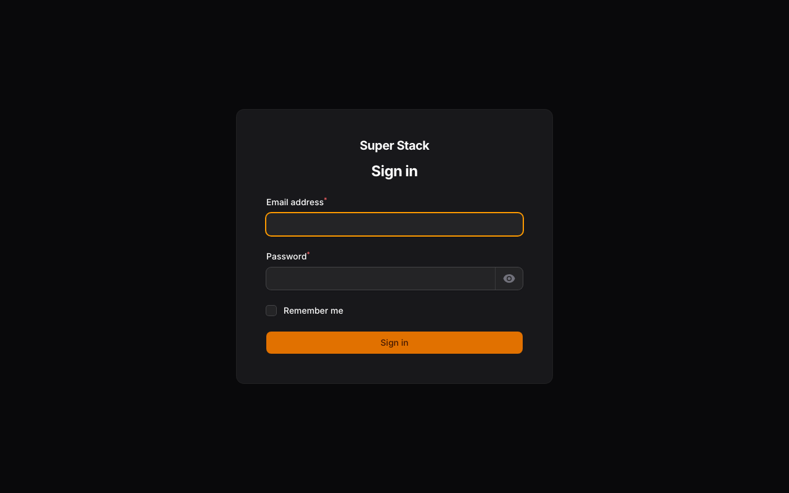

# Super Stack

Open-source Laravel starter kit with **Filament**, **NativePHP SuperNative**, and **Laravel MCP**.





## Stack

| Piece | Package |
| --- | --- |
| Laravel | [`laravel/framework`](https://laravel.com/docs) |
| Admin | [`filament/filament`](https://filamentphp.com/docs) (panel at `/admin`) |
| API auth | [`laravel/sanctum`](https://laravel.com/docs/sanctum) — wired, not demoed |
| Mobile / SuperNative | [`nativephp/mobile`](https://nativephp.com/docs/mobile/4/getting-started/introduction) |
| Native UI | [`nativephp/mobile-ui`](https://github.com/NativePHP/mobile-ui) |
| Web UI (browser EDGE) | [`nativephp/mobile-web`](https://github.com/NativePHP/web-ui) (VCS: [NativePHP/web-ui](https://github.com/NativePHP/web-ui)) |
| MCP server | [`laravel/mcp`](https://laravel.com/docs/mcp) — no auth added |

## Requirements

- PHP 8.4+ (Herd recommended)
- Composer
- Node (optional, for Vite)
- Xcode / Android Studio for native runs ([NativePHP Mobile v4 environment](https://nativephp.com/docs/mobile/4/getting-started/environment))

## Quick start

```bash
composer install
cp .env.example .env
php artisan key:generate
# sqlite is default; touch database/database.sqlite if needed
php artisan migrate

# NativePHP (already installed in this kit; re-run after upgrades)
php artisan native:install both --no-interaction
```

Create a Filament admin user with the [Filament installation docs](https://filamentphp.com/docs/panels/installation#creating-a-user) (`php artisan make:filament-user`).

With Laravel Herd, the site is available at [http://superstack.test](http://superstack.test).

- Home (SuperNative via Web UI): [http://superstack.test](http://superstack.test)
- Admin panel: [http://superstack.test/admin](http://superstack.test/admin)
- API: Sanctum is installed (`routes/api.php`) — wired for token auth, not demoed with sample endpoints beyond `/api/user`

## MCP

Routes live in `routes/ai.php`. **No authentication is configured** on the MCP server — fine for local exploration, not production-ready as-is.

- Web: `POST /mcp/superstack`
- Local: `php artisan mcp:start superstack`

Starter tool: `app-info` (`App\Mcp\Tools\AppInfoTool`) — returns app + package versions.

```bash
php artisan mcp:inspector mcp/superstack
```

See the [Laravel MCP docs](https://laravel.com/docs/mcp) for servers, tools, and auth options.

## Native / SuperNative

Home is a SuperNative screen (`Route::native`). On a phone, [NativePHP Mobile v4](https://nativephp.com/docs/mobile/4/getting-started/introduction) renders it natively; in the browser, Web UI renders the same Blade as HTML.

```bash
php artisan native:run
```

See [Installation](https://nativephp.com/docs/mobile/4/getting-started/installation) and [SuperNative](https://nativephp.com/docs/mobile/4/architecture/super-native).

`NATIVEPHP_APP_ID` defaults to `com.superstack.app` in `.env`. The `nativephp/` directory is gitignored — regenerate with `php artisan native:install`.

## License

MIT
